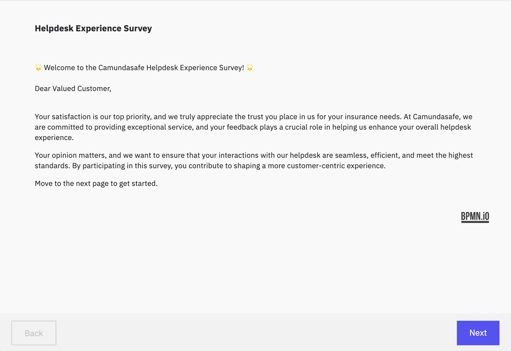

Multi page form-js demo
---


Multi-page form viewer using [form-js](https://github.com/bpmn-io/form-js/). 

This is a demo example how to use form-js to manage and render multi-page forms. Use multi-page forms to build wizards, page flows, surveys, or complex forms for your custom task application or related implementation.



> [!NOTE]  
> This is just a demo, not intended for production usage, but use it as a starting point for your custom task apps.

## Setup

Ensure you have npm v16+ installed on your machine. Simply run

```
npm install
```

To run the demo, run

```
npm run start:dev
```

It will serve the app on http://localhost:8080

To build the web app, run

```
npm run build
```

The build can then be found in the `build` directory.

## What's in the demo

The demo shows a multi-page form viewer that embeds [form-js](https://github.com/bpmn-io/form-js/) to render the individual pages. 

It uses a custom form schema that comprises a list of pages, which are individual form-js forms. The renderer simply picks the current page and renders it. The renderer sports the following features:

- Page renderer
- Responsive navigation buttons
- Page validation before navigation

Some functionality is not implemented but there are hints how to build them, including

- Skip conditions for pages to enable conditional page flows
- Submit the whole data
- How to call the draft variable endpoint of Camunda Tasklist to store intermediate states in order to pause and resume work
- Show number of remaining pages

## How to use it with Camunda 8
Use embedded forms to deliver the custom multi-page form schema over Tasklist. Note that the Camunda Tasklist UI will not render it. 
Alternatively, host the form schema files  yourself and use a custom form key as a reference to retrieve the form.
